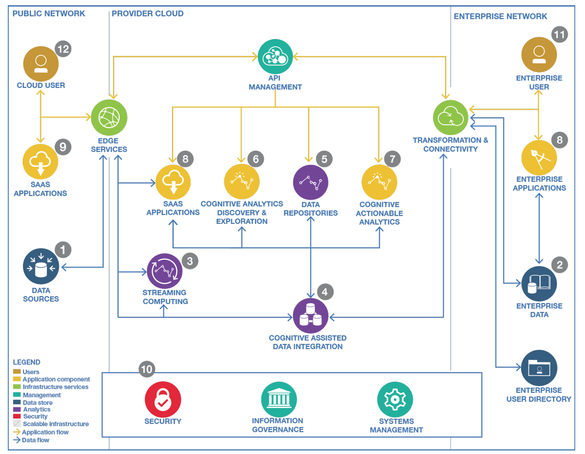

# Analytics Reference Architecture
Big data analytics (BDA) and cloud computing are a top priority for CIOs. Harnessing the value and power of big data and cloud computing can give your company a competitive advantage, spark new innovations, and increase revenue.
As cloud computing and big data technologies converge, they offer a cost-effective delivery model for cloud-based analytics.

This project provides a reference implementation for building and running analytics application deployed on hybrid cloud environment. We are focusing on offering tools and practices for Data Scientists to work efficiently and to IT architect to design hybrid analytics solution.

To get explanation of the components involved in this architecture see [Architecture Center - Analytics Architecture article](https://www.ibm.com/devops/method/content/architecture/dataAnalyticsArchitecture)

# Table of Contents
* [Data Sciences quick introduction](#data-sciences)
* [Solution overview](#solution_overview)
* [Build and Run](#build_and_run)
* [DevOps](#devops)
* [Service management](#service_management)
* [Compendium](#compendium)
* [Contribute](#contribute)

# Data Sciences Introduction
Data science falls into these three categories:
## Descriptive analytics
This is likely the most common type of analytics leveraged to create dashboards and reports. They describe and summarize events that have already occurred. For example, think of a grocery store owner who wants to know how items of each product were sold in all store within a region in the last five years.
## Predictive analytics
This is all about using mathematical and statistical methods to forecast future outcomes. The grocery store owner wants to understand how many products could potentially be sold in the next couple of months so that he can make a decision on inventory levels.
## Prescriptive analytics
Prescriptive analytics is used to optimize business decisions by simulating scenarios based on a set of constraints. The grocery store owner  wants to creating a staffing schedule for his employees, but to do so he will have to account for factors like availability, vacation time, number of hours of work, potential emergencies and so on (constraints) and create a schedule that works for everyone while ensuring that his business is able to function on a day to day basis.

## Methodology
Combining the development of analytics, machine learning and traditional software development involves adapting the agile iterative methodology. At IBM we are using the Design thinking and lean approach for developing innovative business applications. The garage method explains this approach. In [this article](./docs/methodology.md) we cover the specifics activities for analytics. 

# Solution Overview
The approach is to over the following capabilities:
* Develop model with Data Science eXperience
* Integrate to different data sources

The system context may look like:  

# Build and run
* [Notebook samples](jupyter-notebooks/README.md)

# DevOps
## Continuous integration
## Deployment
* [Deploy Data Science eXperience to IBM Cloud Private](docs/ICP/README.md)

## Continuous testing

# Service management  

# Compendium
* [IBM Analytics reference architecture](https://www.ibm.com/cloud/garage/content/architecture/dataAnalyticsArchitecture/dataAnalyticsCustomerExperience)
* [Data Science Experience public page](https://datascience.ibm.com/)
* [IBM Cloud Private](https://www.ibm.com/cloud-computing/products/ibm-cloud-private/)
* [Developer works on Analytics](https://www.ibm.com/developerworks/learn/analytics/)

# Contribute
We welcome your contribution. There are multiple ways to contribute: report bugs and improvement suggestion, improve documentation and contribute code.
We really value contributions and to maximize the impact of code contributions we request that any contributions follow these guidelines
* Please ensure you follow the coding standard and code formatting used throughout the existing code base
* All new features must be accompanied by associated tests
* Make sure all tests pass locally before submitting a pull request
* New pull requests should be created against the integration branch of the repository. This ensures new code is included in full stack integration tests before being merged into the master branch.
* One feature / bug fix / documentation update per pull request
* Include tests with every feature enhancement, improve tests with every bug fix
* One commit per pull request (squash your commits)
* Always pull the latest changes from upstream and rebase before creating pull request.

If you want to contribute, start by using git fork on this repository and then clone your own repository to your local workstation for development purpose. Add the up-stream repository to keep synchronized with the master.
