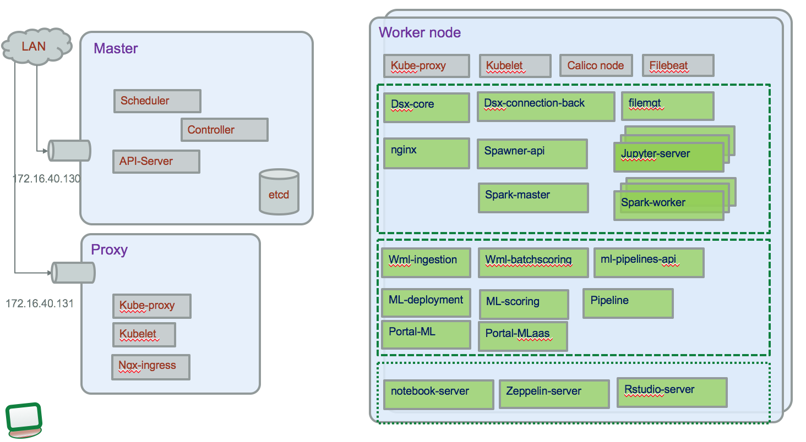
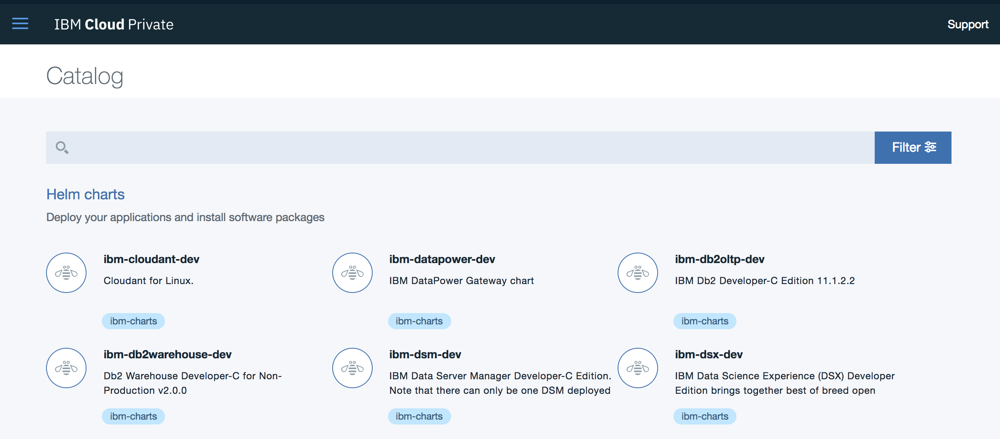
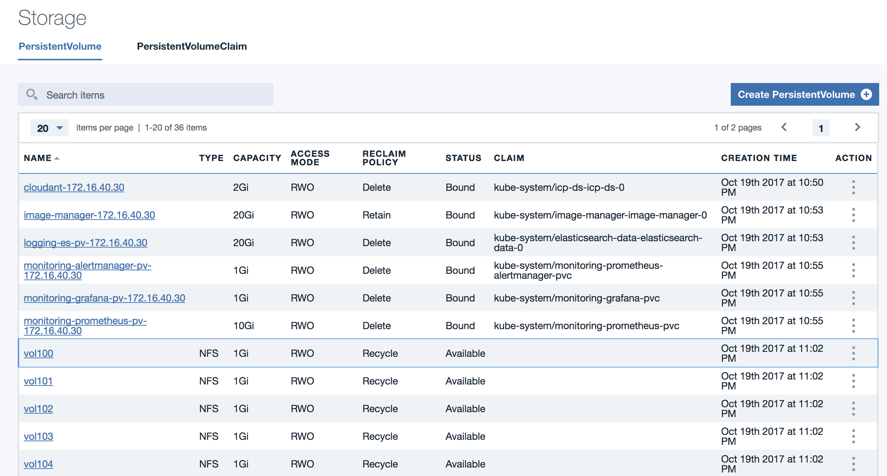
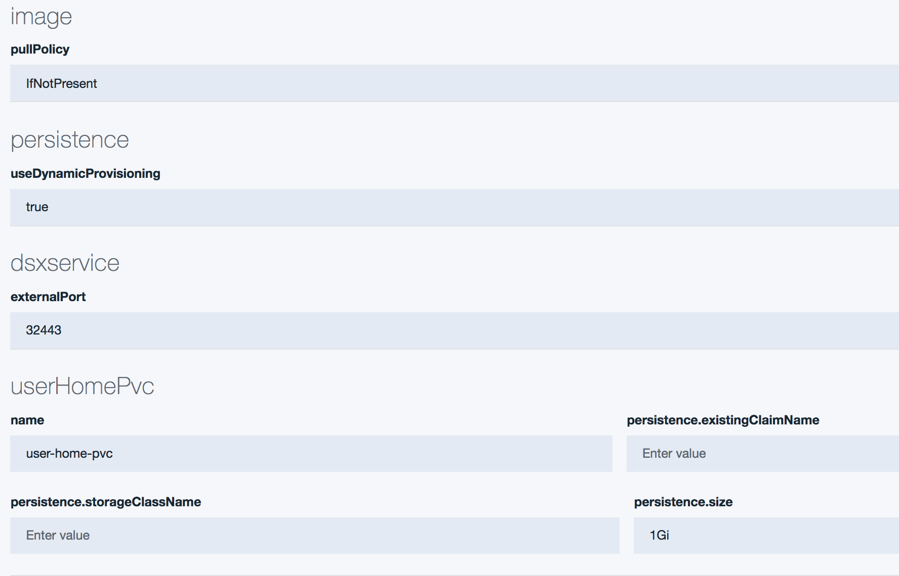
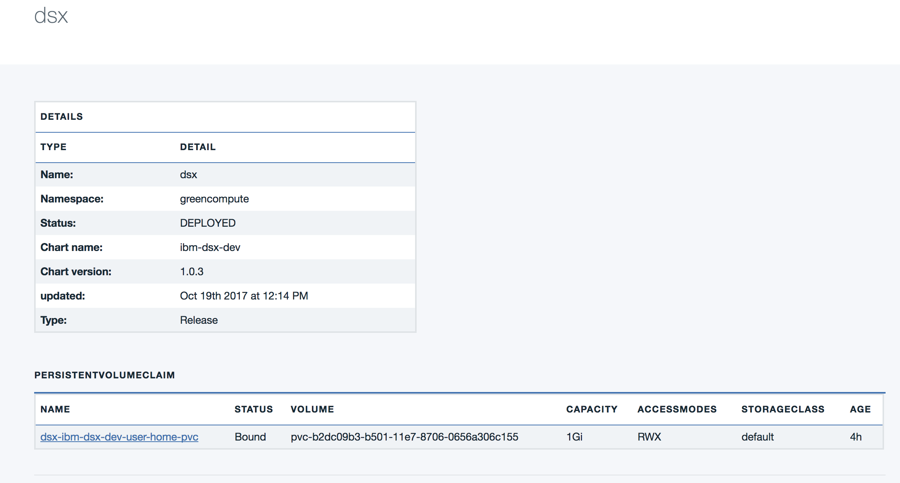
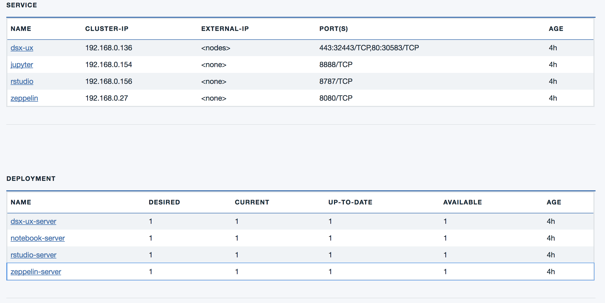

# Deploy Data Science Experience to IBM Cloud Private

There are two possible deployments to run DSX on ICP:

* [DSX developer](#install-dsx-developer-edition) which is the desktop version: web app for DSX, single user.
* [DSX local](#install-dsx-local) with all the worker nodes to support machine learning and collaboration on models.

A production deployment will use DSX local packaging as it will support collaboration between Data Scientists, business analysts and developers.
Once installed validate the installation with at least a test for the following notebooks:
* Learn basics about notebooks and Apache Spark: as it validate jupyter notebook, and spark kernels

## Install DSX Local on ICP
DSX Local includes a set of components working together and deployed as pods:

  

There are multiple namespaces defined in the installation to manage the DSX local components. The notebook, zeppelin and R studio servers are running in a user scoped namespace for multitenancy support.

The spark master control the job allocation to the spark workers.

### Prerequisites
DSX Local is shipped as a bundle product, and can be access via Passport Advantage.  ICP needs to be configured with enterprise edition with at least two master and two proxy nodes, and three worker nodes. The configuration and capacity planning for the platform will be addressed in a separate note, and it will depend of the type of workloads deployed to the cluster.

#### Our configuration
We would like to share our test configuration so you can plan accordingly. Here is our hardware allocation:


Some tricks for considerations:
* All VM were set to run with static IP address. So do not forget to specify the dns-nameservers as part of the configuration of the **/etc/network/interfaces file**, as some installation need to resolve external name server.
```
iface ens160 inet static
	address 172.16.40.135
	netmask 255.255.0.0
	broadcast 172.16.255.255
	gateway 172.16.255.250
	dns-nameservers 172.16.0.11 172.16.0.17
	dns-search csplab.local
```
* the hosts file in the cluster folder needs to reflect the topology
```
```
* All the hosts need to have the same /etc/hosts
```
172.16.40.130   green-icp-master.csplab.local green-icp-master
172.16.40.131	green-icp-proxy.csplab.local green-icp-proxy
172.16.40.132   green-icp-worker1.csplab.local green-icp-worker1
172.16.40.133   green-icp-worker2.csplab.local green-icp-worker2
172.16.40.134   green-icp-worker3.csplab.local green-icp-worker3
172.16.40.135   green-management.csplab.local green-management
```

Once ICP is installed, install the following tools on one of the master nodes:

* [bx](https://console.bluemix.net/docs/cli/index.html) CLI
* [ICP Plugin](https://www.ibm.com/support/knowledgecenter/SSBS6K_2.1.0/manage_cluster/install_cli.html) for bx CLI.  

  The download can be retrieved from the master host using:

  ```bash
  # wget --no-check-certificate https://<master-host>:8443/api/cli/icp-linux-amd64
  ```

  Then added as a plugin to `bx` CLI using:

  ```bash
  # bx plugin install ./icp-linux-amd64
  ```

* [kubectl](https://kubernetes.io/docs/tasks/tools/install-kubectl/) CLI

  The appropriate version can be downloaded using the following for ICP 2.1.0:

  ```bash
  # docker run -e LICENSE=accept --net=host -v /usr/local/bin:/data ibmcom/kubernetes:v1.7.3-ee cp /kubectl /data
  ```

* [helm](https://github.com/kubernetes/helm/releases/tag/v2.6.0) CLI v2.6.0

  The appropriate version can be installed using the following for ICP 2.1.0:

  ```bash
  docker run -t --entrypoint=/bin/cp -v /usr/local/bin:/data ibmcom/helm:v2.6.0  /helm /data/
  ```

### Storage considerations
As of now NFS type of storage doesn't support dynamic storage provisioning.
For dynamic storage it is recommended to use [GlusterFS](https://www.gluster.org/) with two Nodes cluster outside of ICP. Each node will need have an extra raw disk attached to it.

### Load the Chart Bundle

Add the self-signed certificates for the web UI to the system-wide trust store where the commands are run (i.e. the master host).  For Ubuntu 16.04, this can be done using the following commands, as root:

```bash
# mkdir -p /usr/local/share/ca-certificates/icp
# cp /etc/cfc/conf/ca.crt /usr/local/share/ca-certificates/icp
# cp /etc/cfc/conf/icp-auth.crt /usr/local/share/ca-certificates/icp
# update-ca-certificates
```

Authenticate to the ICP cluster using the `bx pr` commands:

```bash
# bx pr login -a https://<master host>:8443
# bx pr init
```

Log in to the docker private registry using the administrator credentials. For example if the cluster name is `mycluster.icp`:

```bash
# docker login mycluster.icp:8500
```

Retrieve the package and load it into the local helm and image repositories using this command.  

```bash
# bx pr load-ppa-archive --archive ibm-dsx-local-linux-x86-icp-2.1.0.tar.gz
```
This places the Helm chart for DSX Local into the `local-charts` repository, and all of the images into the Docker private registry running ICP.

### Installing using the Helm CLI

As of now the DSX Local must be installed four times into four different namespaces, making an installation from the Catalog longer.  You may still look at the chart, called `ibm-dsx-prod`, in the Catalog to find out more information about the topology and installation instructions.  We will use the `helm` CLI to install it from the master node instead of the catalog.

Set up the `kubectl` context before beginning (use the 'configuration client menu in ICP').  This configures and authenticates the `kubectl` and `helm` with the ICP cluster. If the cluster is named `mycluster`,

```bash
# bx pr cluster-config mycluster
```

Create each of the four namespaces that DSX Local requires:

```bash
# kubectl create namespace sysibmadm-data
# kubectl create namespace sysibm-adm
# kubectl create namespace dsxl-ml
# kubectl create namespace ibm-private-cloud
```

Set up the `default` service account in the `ibm-private-cloud` namespace that DSX uses so that the `spawner-api` service is able to create notebook pods dynamically in the `ibm-private-cloud` namespace:

```bash
# kubectl create rolebinding ibm-private-cloud-admin-binding --clusterrole=admin --user="system:serviceaccount:ibm-private-cloud:default" --namespace=ibm-private-cloud
```

If you do not have a dynamic storage provisioner, pre-create the PersistentVolumes.  If you have cloned this project, the files can be found in the [helm](../helm) directory.  Be sure to update the parameters in each of the PersistentVolume yamls to use the correct values for `<NFS Server>` and `<NFS PATH>`, and pre-create the directories for each of the PVs in the NFS server.

```bash
# kubectl create pv -f user-home-pv-1.yaml
# kubectl create pv -f spark-metrics-pv-1.yaml
# kubectl create pv -f cloudant-repo-pv.yaml
# kubectl create pv -f redis-repo-pv.yaml
```

Retrieve the chart from the helm chart repository:

```bash
# wget https://mycluster.icp:8443/helm-repo/requiredAssets/ibm-dsx-prod-1.0.0.tgz
```

Now, install the chart four times:

```bash
# helm install --namespace sysibmadm-data --name dsxns1  ibm-dsx-prod-1.0.0.tgz
# helm install --namespace sysibm-adm --name dsxns2 ibm-dsx-prod-1.0.0.tgz
# helm install --namespace dsxl-ml --name dsxns3 ibm-dsx-prod-1.0.0.tgz
# helm install --namespace ibm-private-cloud --name dsxns4 ibm-dsx-prod-1.0.0.tgz
```

Note, if a dynamic storage provisioner is available, you can enable it using the following, and the `default` storage class will be used:

```bash
# helm install --namespace sysibmadm-data --name dsxns1  ibm-dsx-prod-1.0.0.tgz --set persistence.useDynamicProvisioning=true
# helm install --namespace sysibm-adm --name dsxns2 ibm-dsx-prod-1.0.0.tgz --set persistence.useDynamicProvisioning=true
# helm install --namespace dsxl-ml --name dsxns3 ibm-dsx-prod-1.0.0.tgz --set persistence.useDynamicProvisioning=true
# helm install --namespace ibm-private-cloud --name dsxns4 ibm-dsx-prod-1.0.0.tgz --set persistence.useDynamicProvisioning=true
```

The Data Science Experience console will be available on https://&lt;proxy-node-ip&gt;:31843, using the default login/password of `admin`/`password`.

# Install DSX Developer Edition

ICP includes in its base helm catalog a Data Science eXperience Developer edition chart as illustrated in figure below:



The DSX [developer edition](https://datascience.ibm.com/docs/content/desktop/welcome.html) is also known as DSX Desktop and is designed for users who want to learn more about the Data Science discipline. It includes:

* [Jupyter Notebook](http://jupyter.org)
* [Zeppelin](https://zeppelin.apache.org)
* [R studio](https://www.rstudio.com)
* Basic [Anaconda](https://www.anaconda.com/what-is-anaconda/) packages: numpy, pandas, jupyterm scipy, tensorflow...
* CPLEX

There are 4 steps to do:

* create a namespace to isolate the deployment, or use an existing non-default or system namespaces.
* create a permanent storage to keep the notebook and datasets created using DSX
* deploy DSX
* validate the deployment by running one notebook of each type: jupyter, zeppelin, and R.

### Namespace

To install DSX dev on ICP, first create a [k8s namespace](https://kubernetes.io/docs/concepts/overview/working-with-objects/namespaces/) like **greencompute** using the ICP console, Admin > namespaces


You could also use the kubectl command:

```
$ kubectl get namespaces
$ kubectl create namespace greencompute
```
### Storage
Then deploying DSX Developer requires a persistent volume to persist notebooks, data..., and any other artifacts needed by data scientists.
```
PersistenceVolume (PV) is a piece of storage in the cluster that has been provisioned by an administrator. It is a resource in the cluster, and it is used store data after the life of the pod. We assume there is a NFS or gluster FS server available.
```
Going to Platform > Storage menu in ICP console, you can see the current persistent volumes.



 Create a new one named: dsx-pv, with 2Gi, access mode= read write many, Storage type as NFS.

 IBM Cloud Private will allow overprovisioning of storage. This means that even if your remote storage has only 50Gi available, you can still provision 100Gi of space to storage. You should monitor the storage utilization on your NFS server.

 

The persistentVolumes we currently support are HostPath, NFS, and Gluster.

For the access mode the setting needs to be ReadWriteMany (RWW) as it allows many different PVCs to bind to it simultaneously and all may read write at the same time. Other settings are ReadWriteOnce (RWO) means that only a single PVC can use the PV at a time and that volume has ReadWrite access. Once a PVC is bound to a PV with this Access Mode, it is unusable to any other PVC until that PV is destroyed and its claim is released.

The *Retain* attribute means that when the PVC has finished using the PV, it leaves all the data it created on the PV and an administrator will have to manually clean it up later.

For more background about persistentVolumes from our knowledge centre [click here](https://www.ibm.com/support/knowledgecenter/SSBS6K_2.1.0/manage_cluster/create_volume.html) and from kubernetes documentation [click here](https://kubernetes.io/docs/concepts/storage/persistent-volumes/).

Add a label named assign-to with the value **user-home**.

Add parameters to specify the address of the NFS server, or DNS name, and the path used to mount the filesystem to the DSX docker image.

 

Any PersistenceVolumeClaim can be bound to any PV that satisfies the request.


As an alternate you could have create a yaml file to define the persistence volume (see the file ../../helm/dsx-pv.yaml) and use the command `kubectl create -f dsx-pv.yaml`

```yaml
apiVersion: v1
kind: PersistentVolume
metadata:
  name: dsx-pv
  labels:
    assign-to: "user-home"
spec:
  capacity:
    storage: 2Gi
  accessModes:
    - ReadWriteMany
  nfs:
    server: 172.16.50.250
    path: /storage/vol15
```

Now deploy the ibm-dsx-dev helm charts, use **dsx** as release name, and **greencompute** as namespace.


Change the persistence.useDynamicProvisioning to true



Once completed go to the Helm release menu and select the **dsx** release. The following figure displays the metadata about the release and the PV claim. The PVC needs to be bound to a persistence volume. Following the PVC link will present which PV is linked.



The lower part of the release information panel (as illustrated below) lists the services and deployments created by the installation. the *ux* is for the web interface to access DSX. The other services are for running notebooks kernels.




### Using CLI

So the most simple way is to use the following commands once connected to the cluster.

```
helm install --name dsx --namespace greencompute --set dsxservice.externalPort=32443 ibm-dsx-dev:v1.0.3
```

### Confirming DSX is running
To know DSX developer is finished deploying we can confirm a few things. Using the ICP admin console locate: *Workloads -> Deployments -> dsx-ux-server*.
You should see one pod. Select the pod and then go to the *Events* menu
