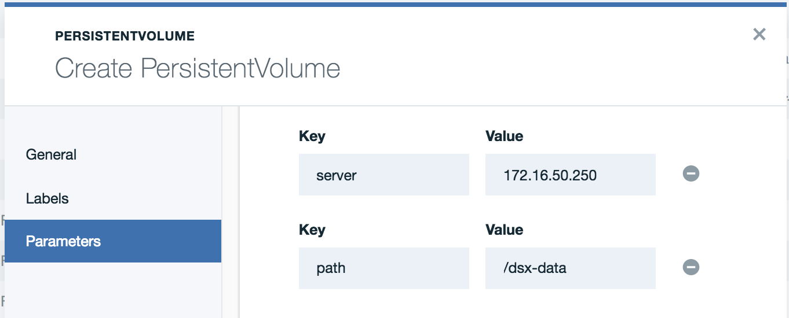

# Deploy Data Science to IBM Cloud Private
There are two possible deployment
* DSX developer which is the desktop version: web app for DSX
* DSX local with all the worker nodes

## Install DSX Developer
ICP includes in its base helm repository a DSX dev chart as illustrated in figure below:


The DSX [developer edition](https://datascience.ibm.com/docs/content/desktop/welcome.html) is also know as DSX desktop and it includes:
* Notebooks
* R studio
* Basic [Anaconda](https://www.anaconda.com/what-is-anaconda/) packages: numpy, pandas, jupyterm scipy, tensorflow...
* CPLEX

To install DSX on ICP, first create a namespace like **greencompute** using the ICP console, Admin > namespaces


Then deploying DSX Developer requires a persistent volume to persist notebook, and other artifacts needed by data scientist.
```
PersistenceVolume (PV) is a piece of storage in the cluster that has been provisioned by an administrator. It is a resource in the cluster, and it is used store data after the life of the pod. We assume there is a NFS or gluster FS server available.
```
Going to Platform > Storage menu in ICP console, you can see the current persistent volumes.


 Create a new one named: dsx-pv, with 2Gi, access mode= read write many, Storage type as NFS.
 
Add a label named assign-to with the value user-home
Add parameters to specify the address of the NFS server, or DNS name, and the path used to mount the filesystem to the DSX docker image.
 

As an alternate you could have create a yaml file to define the persistence volume (see the file ../../helm/dsx-pv.yaml) and use the command `kubectl create -f dsx-pv.yaml`

```yaml
apiVersion: v1
kind: PersistentVolume
metadata:
  name: dsx-pv
  labels:
    assign-to: "user-home"
spec:
  capacity:
    storage: 2Gi
  accessModes:
    - ReadWriteMany
  nfs:
    server: 172.16.50.250
    path: /mnt/user-home
```

Now deploy the ibm-dsx-dev helm charts, use **dsx** as release name, and **greencompute** as namespace.


Change the persistence.useDynamicProvisioning to true


Once completed go to the Helm release menu.

## Using CLI
So the most simple way is to use the following commands once connected to the cluster.

```
helm install --name dsx --namespace greencompute --set dsxservice.externalPort=32443 ibm-dsx-dev:v1.0.3
```
