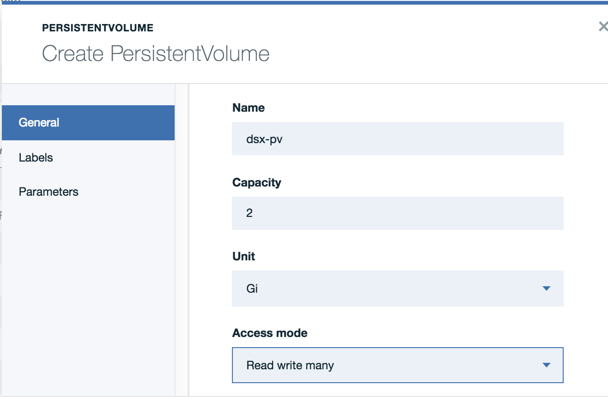

# Deploy Data Science eXperience to IBM Cloud Private

There are two possible deployments to run DSX on ICP:
* DSX developer which is the desktop version: web app for DSX, mono user.
* DSX local with all the worker nodes to support machine learning and collaboration on models.

A production deployment will use DSX local packaging as it will support collaboration between Data Scientists, business analysts and developers.

## Install DSX Developer
ICP includes in its base helm catalog a Data Science eXperience Developer edition chart as illustrated in figure below:


The DSX [developer edition](https://datascience.ibm.com/docs/content/desktop/welcome.html) is also know as DSX desktop and it includes:
* Notebooks
* R studio
* Basic [Anaconda](https://www.anaconda.com/what-is-anaconda/) packages: numpy, pandas, jupyterm scipy, tensorflow...
* CPLEX

There are 4 steps to do:
* create a namespace to isolate the deployment, or use an existing non-default or system namespaces.
* create a permanent storage to keep the notebook and datasets created using DSX
* deploy DSX
* validate the deployment by running one notebook of each type: jupyter, zeppelin, and R.

### Namespace

To install DSX dev on ICP, first create a [k8s namespace](https://kubernetes.io/docs/concepts/overview/working-with-objects/namespaces/) like **greencompute** using the ICP console, Admin > namespaces


You could also use the kubectl command:

```
$ kubectl get namespaces
$ kubectl create namespace greencompute
```
### Storage
Then deploying DSX Developer requires a persistent volume to persist notebooks, data..., and any other artifacts needed by data scientists.
```
PersistenceVolume (PV) is a piece of storage in the cluster that has been provisioned by an administrator. It is a resource in the cluster, and it is used store data after the life of the pod. We assume there is a NFS or gluster FS server available.
```
Going to Platform > Storage menu in ICP console, you can see the current persistent volumes.


 Create a new one named: dsx-pv, with 2Gi, access mode= read write many, Storage type as NFS.

 IBM Cloud Private will allow overprovisioning of storage. This means that even if your remote storage has only 50Gi available, you can still provision 100Gi of space to storage. You should monitor the storage utilization on your NFS server.

 

The persistentVolumes we currently support are HostPath, NFS, and Gluster.

For the access mode the setting needs to be ReadWriteMany (RWW) as it allows many different PVCs to bind to it simultaneously and all may read write at the same time. Other settings are ReadWriteOnce (RWO) means that only a single PVC can use the PV at a time and that volume has ReadWrite access. Once a PVC is bound to a PV with this Access Mode, it is unusable to any other PVC until that PV is destroyed and its claim is released.

The *Retain* attribute means that when the PVC has finished using the PV, it leaves all the data it created on the PV and an administrator will have to manually clean it up later.

For more background about persistentVolumes from our knowledge centre [click here](https://www.ibm.com/support/knowledgecenter/SSBS6K_2.1.0/manage_cluster/create_volume.html) and from kubernetes documentation [click here](https://kubernetes.io/docs/concepts/storage/persistent-volumes/).

Add a label named assign-to with the value **user-home**.

Add parameters to specify the address of the NFS server, or DNS name, and the path used to mount the filesystem to the DSX docker image.

 

Any PersistenceVolumeClaim can be bound to any PV that satisfies the request.


As an alternate you could have create a yaml file to define the persistence volume (see the file ../../helm/dsx-pv.yaml) and use the command `kubectl create -f dsx-pv.yaml`

```yaml
apiVersion: v1
kind: PersistentVolume
metadata:
  name: dsx-pv
  labels:
    assign-to: "user-home"
spec:
  capacity:
    storage: 2Gi
  accessModes:
    - ReadWriteMany
  nfs:
    server: 172.16.50.250
    path: /storage/vol15
```

Now deploy the ibm-dsx-dev helm charts, use **dsx** as release name, and **greencompute** as namespace.


Change the persistence.useDynamicProvisioning to true


Once completed go to the Helm release menu and select the **dsx** release. The following figure displays the metadata about the release and the PV claim. The PVC needs to be bound to a persistence volume. Following the PVC link will present which PV is linked.


The lower part of the release information panel (as illustrated below) lists the services and deployments created by the installation. the *ux* is for the web interface to access DSX. The other services are for running notebooks kernels.


## Using CLI
So the most simple way is to use the following commands once connected to the cluster.

```
helm install --name dsx --namespace greencompute --set dsxservice.externalPort=32443 ibm-dsx-dev:v1.0.3
```

## Confirming DSX is running
To know DSX developer is finished deploying we can confirm a few things. Using the ICP admin console locate: *Workloads -> Deployments -> dsx-ux-server*.
You should see one pod. Select the pod and then go to the *Events* menu
