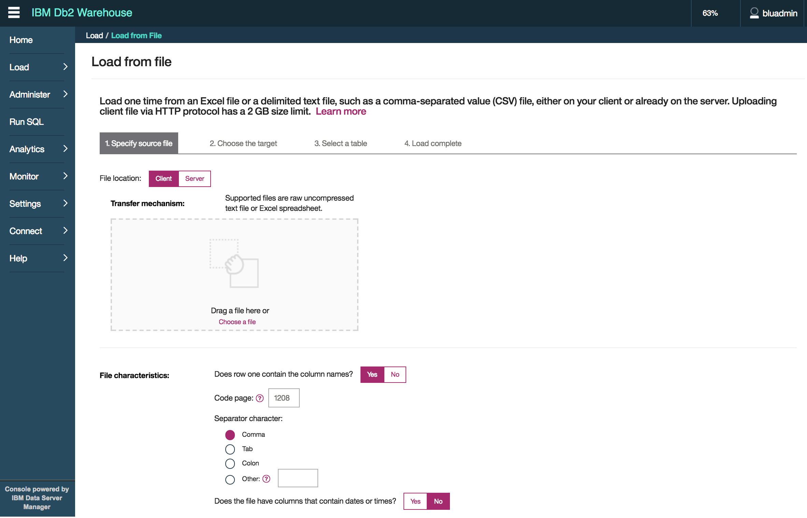
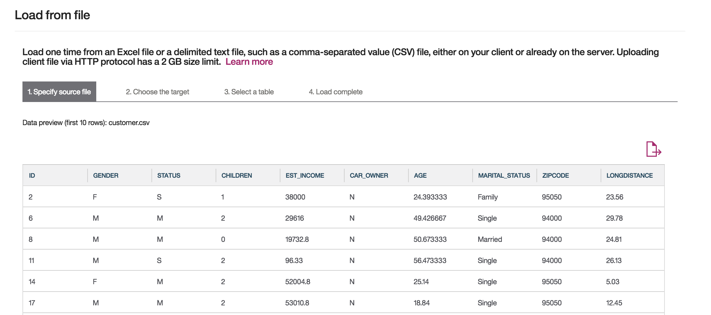
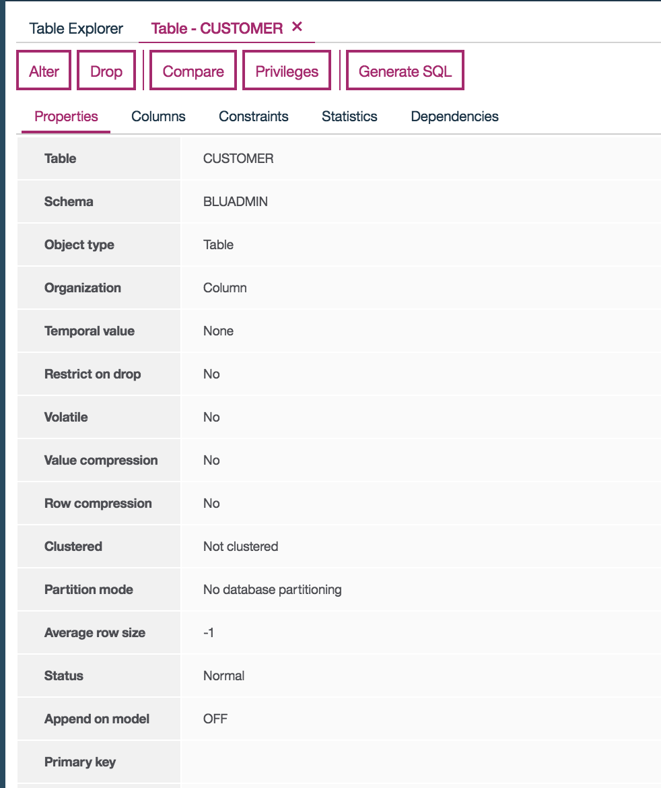

# DB2 Warehouse deployment on ICP

Db2 Warehouse is an analytics data warehouse that you deploy by using a Docker container, allowing you control over data and applications.

There are two deployment packages for [DB2 Warehouse](https://www.ibm.com/hr-en/marketplace/db2-warehouse) on ICP, development and production. We used the production deployment.

A pre-requisite for deployment is to have a persistent volume that is at least 50 GiB.

## What Type of Persistent Storage to use

We looked at two common options, NFS and [Gluster](https://www.gluster.org/). A fairly simple but repeatable workload that had an IO component was used to test performance metrics. This workload was based on the [TPC-D benchmark](http://www.tpc.org/tpcd/default.asp).

### NFS

This is the simplest storage to define. When Db2 was deployed using NFS as its persistent storage we saw the best performance with no additional tuning. For a quick, reloadable environment this is the simplest and fastest choice.

### Gluster

We used a 4-way dispersed volume with 2-brick redundancy for a total of 6 "disks". Initial deployment had performance characteristics 15-30% slower. Gluster does have the advantage of redundancy and parallelism of IO so would be recommended for longer-term database requirements in the environment.

#### Turbo-Charging Gluster

Since part of Gluster's advantage is dispersed IO and redundancy we made a simple change to how data was stored in DB2 that added another parallelization layer. Knowing that the gluster file system consisted of 6 bricks we created a new storage group to have 6 containers and tablespaces to use that storage group. We used `select db_storage_path from table(admin_get_storage_paths('',-1)) where storage_group_name = 'IBMSTOGROUP'` to find the path used by the deployment.

```
create stogroup sto6 on '/path', '/path', '/path', '/path', '/path', '/path';
create tablespace data1 automatic using stogroup sto6;
```

All tables would then be created in the data1 tablespace.

Alternatively you can run `alter stogroup ibmstogroup add '/path', '/path', '/path', '/path', '/path'` to modify the default storage group and all tables created afterward would then have the same IO characteristics.

Performance testing done with this new storage group were identical to NFS performance statistics.

## Deploy DB2 chart to ICP
As an ICP administrator user, select from the catalog the  'ibm-db2warehouse-prod' chart for your production deployment.


Then in the configuration settings be sure to specify the persistent volume claim created previously.

## Useful articles
* https://github.ibm.com/IBMPrivateCloud/charts/tree/master/stable/ibm-db2warehouse-prod
* For more information about Db2 Warehouse, see the IBM Db2 Warehouse documentation. (https://www.ibm.com/support/knowledgecenter/SS6NHC/com.ibm.swg.im.dashdb.kc.doc/welcome.html)


## Troubleshooting DB2
From the ICP admin console try to see the DB2 deployment and then the pod name.
With `helm list` you can see the deployed ibm-db2-warehouse-prod release(s).

The release detailed status:
```
$ helm status <deployment name>

LAST DEPLOYED: Mon Dec 11 10:34:06 2017
NAMESPACE: db2-warehouse
STATUS: DEPLOYED

RESOURCES:
==> v1/PersistentVolumeClaim
NAME                                    STATUS  VOLUME             CAPACITY  ACCESSMODES  STORAGECLASS  AGE
db2-gc-ibm-db2warehouse-prod-pvc1  Bound   db2wh-pv-hostpath  50Gi      RWO          17m

==> v1/Service
NAME                               CLUSTER-IP  EXTERNAL-IP  PORT(S)                                         AGE
db2-gc-ibm-db2warehouse-prod  10.0.0.16   <nodes>      50000:32166/TCP,50001:31560/TCP,8443:31107/TCP  17m

==> v1beta1/Deployment
NAME                               DESIRED  CURRENT  UP-TO-DATE  AVAILABLE  AGE
db2-gc-ibm-db2warehouse-prod  1        1        1           1          17m


NOTES:
Get the database URL by running these commands:
  export NODE_PORT=$(kubectl get --namespace db2-warehouse -o jsonpath="{.spec.ports[0].nodePort}" services db2-gc-ibm-db2warehouse-prod)
  export NODE_IP=$(kubectl get nodes --namespace db2-warehouse -o jsonpath="{.items[0].status.addresses[0].address}")
  echo jdbc:db2://$NODE_IP:$NODE_PORT/bludb:user=<>;password="<>"
```

The port number mappings are important to build the URL to access the Console, see how the 8443 internal port is mapped to 31107 external port. The url uses the proxy IP address and becomes something like https://172.16.40.131:31107. The admin user is `bluadmin`

The following kubectl will give the information of the pod as well.
```
$ kubectl get pods --namespace db2-warehouse
NAME                                         READY     STATUS    RESTARTS   AGE
db2-ibm-db2warehouse-prod-3772094781-3z4m3   1/1       Running   0          35m

$ kubectl describe pod db2-ibm-db2warehouse-prod-3772094781-3z4m3 --namespace db2-warehouse
```

As of now 12/2017 the logs in ICP do not have information on DB2 state, so to access the db2 logs we need to connect to the pod:
```
# kubectl exec -it <pod name> bash
$ kubectl exec -it db2-ibm-db2warehouse-prod-3772094781-3z4m3 bash --namespace db2-warehouse
$ tail -f /var/log/dashdb_local.log
```

If you need to assess id DB2 is running use: `ps -ef | grep db2sysc` inside the pod.


## Loading customer sample data
To be sure database is up and running we can use the Load data from file wizard. From the Db2 main paged accessed via a URL like https://172.16.40.131:31107/console


go to Load > Load from file, and select the customer.csv file from [the cognitive analytics project] (https://github.com/ibm-cloud-architecture/refarch-cognitive-analytics) under the `data` folder. Be sure to specify that the first row is including a table header and the separator is a comma.



The next step displays the 10 first rows of the loaded file



Then create a specific new table, as there is no Customer table yet in the database:


Finally when the table is created and data loaded it is possible to use the table explorer to look at the table meta data, and data records:



### Accessing the data from Java client
The kubectl command can help you identifying the jdbc setting to use to access the database from a Java Client like the Eclipse Database Development perspective.

```
$ kubectl get service --namespace db2-warehouse
$ export NODE_PORT=$(kubectl get --namespace db2-warehouse -o jsonpath="{.spec.ports[0].nodePort}" services db2-gc-ibm-db2warehouse-prod)
$ export NODE_IP=$(kubectl get nodes --namespace db2-warehouse -o jsonpath="{.items[0].status.addresses[0].address}")

$ echo jdbc:db2://$NODE_IP:$NODE_PORT/bludb:user=<>;password="<>"

```
