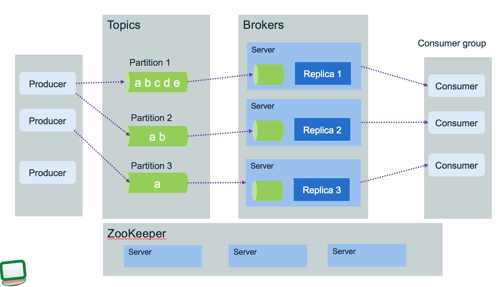
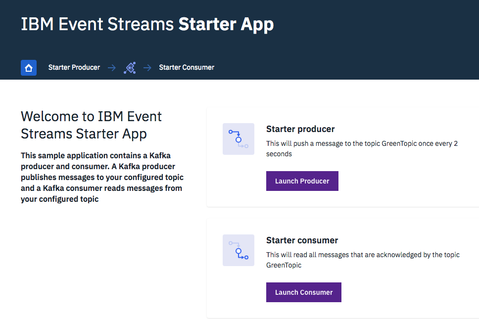

# Apache Kafka
[Kafka]() is a distributed streaming platform. It has three key capabilities:
* Publish and subscribe to streams of records, similar to a message queue or enterprise messaging system.
* Store streams of data records on disk and replicate within the cluster for fault-tolerance.
* It is built on top of the ZooKeeper synchronization service
* Process streams of records as they occur.



## Summary
* Kafka is run as a cluster on one or more **broker** servers that can span multiple data centers.
* The Kafka cluster stores streams of records in **topics**.
* Each broker may have zero or more partitions per topic.
* Each partition is ordered immutable sequence of records.
* Each record consists of a key, a value, and a timestamp.
* Consumer publish data records to topics and consumers subscribe to topics.
* Each partition is replicated among brokers.
* Each partition is replicated across a configurable number of servers for fault tolerance
* Each partitioned message has a unique sequence id called **offset** (abcde, ab, a are offsets).
* offsets are maintained in Zookeeper, so consumer can read next message correctly even during broker server outrages.
* Kafka uses topics with a pub/sub combined with queue model: it uses the concept of consumer group to divide the processing over a collection of consumer processes, and message can be broadcasted to multiple groups.
* Zookeeper is used to keep cluster state, notify consumers and producers for new or failed broker
* Stream processing is helpful for handling out-of-order data, *reprocessing* input as code changes, and performing stateful computations. It uses producer / consumer, stateful storage and consumer groups. It treats both past and future data the same way.
* Consumer performs asynchronous pull to the connected broker via the subscription to a topic

###  Use cases
* Aggregation of event coming from multiple producers.
* Monitor distributed applications to produce centralized feed of operational data.
* Logs collector from multiple services


### Kafka Stream Details
Stream has the following capabilities:
* Continuous real time flow of records
* It supports exactly-once processing semantics to guarantee that each record will be processed once and only once even when there is a failure
* stream APIs transform, aggregate and enrich data, per record with milli second latency, from one topic to another one.
* support stateful and windowing operations by processing one record at a time.
* Can be integrated in java application and micro service. No need for separate processing cluster. It is a Java API. Stream app is done outside of the broker code!.
* Elastic, highly scalable, fault tolerance
* Deploy to container

### Architecture
[](kafka-stream-arch.png)
* Kafka Streams partitions data for processing it. Partition enables data locality, elasticity, scalability, high performance, and fault tolerance
* The keys of data records determine the partitioning of data in both Kafka and Kafka Streams
* An application's processor topology is scaled by breaking it into multiple tasks.
* Tasks can then instantiate their own processor topology based on the assigned partitions


## Run Kafka in Docker
### On Linux
If you run on a linux operating system, you can use the [Spotify kafka image](https://hub.docker.com/r/spotify/kafka/) from dockerhub as it includes [Zookeeper]() and Kafka in a single image.

It is started in background (-d), named "kafka" and mounting scripts/kafka folder to /scripts
```
docker run -d -p 2181:2181 -p 9092:9092 -v `pwd`:/scripts --env ADVERTISED_HOST=`docker-machine ip \`docker-machine active\`` --name kafka --env ADVERTISED_PORT=9092 spotify/kafka
```

Then remote connect to the docker running instance to open a shell:
```
docker exec  -ti kafka /bin/bash
```

Create a topic: it uses zookeeper as a backend to persist persist partition within the topic.

```
./kafka-topics.sh --create --zookeeper localhost:2181 --replication-factor 1 --partitions 1 --topic mytopic
./kafka-topics.sh --list --zookeeper localhost:2181
```
We have done shell scripts for you to do those command and test your local kafka and then the kafka deployed on ICP. The scripts are under ../scripts/kafka
* createtopic.sh
* listtopic.sh
* sendText.sh  Send a multiple lines message on mytopic topic- open this one in one terminal.
* consumeMessage.sh  Connect to the topic to get messages. and this second in another terminal.

### On MACOS
Go to the `scripts/kafka` folder and start a 4 docker containers solution with Kafka, ZooKeeper, REST api, and schema registry using `docker-compose up` command. The images are from [confluent](https://github.com/confluentinc/)
```
REPOSITORY                         TAG                 IMAGE ID            CREATED             SIZE
confluentinc/cp-schema-registry    latest              31837a7d646d        6 days ago          673MB
confluentinc/cp-kafka-rest         latest              4b878c9e48f0        6 days ago          663MB
confluentinc/cp-kafka              latest              c3a2f8363de5        6 days ago          562MB
confluentinc/cp-zookeeper          latest              18b57832a1e2        6 days ago          562MB
```

@@@@ To continue

## Install on ICP
*(Tested on May 2018 on ibm-eventstreams-dev helm chart 0.1.1 of 5/24 on ICP 2.1.0.3)*

You can use the `ibm-eventstreams-dev` Helm chart from ICP catalog the instructions can be found [here](https://developer.ibm.com/messaging/event-streams/docs/install-guide/).  
You need to decide if persistence should be enabled for ZooKeeper and Kafka broker. Allocate one PV per broker and ZooKeeper server or use dynamic provisioning but ensure expected volumes are present.

For the release name take care to do not use a too long name as there is an issue on name length limited to 63 characters.

The screen shots below presents the release deployment results:

This figure above illustrates the following:
* ConfigMap for UI, kafka proxy, kafka REST api proxy.
* The three deployment for each major components: UI, REST and controller.


The roles, rolebinding and secret as part of the Role Based Access Control.


The service to expose capabilities to external world via nodePort type:
* admin console port 32492 on the k8s proxy IP address
* REST api port 30031
* stream proxy port bootstrap: 31348, broker 0: 32489...

To get access to the Admin console by using the IP address of the master pr proxy node and the port number of the service, which you can get using the kubectl get service information command like:
```
kubectl get svc -n greencompute "greenkafka-ibm-eventstreams-admin-ui-proxy-svc" -o 'jsonpath={.spec.ports[?(@.name=="admin-ui-https")].nodePort}'

```


Use the Event Stream Toolbox to download a getting started application. One example of the generated app is in the IBMEventStreams_GreenKafkaTest folder, and a description on how to run it is in the [readme](../../IBMEventStreams_GreenKafkaTest/README.md)

The application runs in Liberty at the URL: http://localhost:9080/GreenKafkaTest/ and delivers a nice simple interface   

to test the producer and consumer of test message:

  


  

## Verifying installation for kafka running in ICP
Once connected to the cluster with kubectl with commands like:
```
kubectl config set-cluster cluster.local --server=https://172.16.40.130:8001 --insecure-skip-tls-verify=true
kubectl config set-context cluster.local-context --cluster=cluster.local
kubectl config set-credentials admin --token=e.......
kubectl config set-context cluster.local-context --user=admin --namespace=greencompute
kubectl config use-context cluster.local-context
```
Get the list of pods for the namespace you used to install kafka / event streams:
```
$ kubectl get pods -n greencompute
NAME                                                              READY     STATUS    RESTARTS   AGE
greenkafka-ibm-eventstreams-kafka-sts-0                           1/2       Running   32         1d
greenkafka-ibm-eventstreams-kafka-sts-1                           2/2       Running   10         1d
greenkafka-ibm-eventstreams-kafka-sts-2                           2/2       Running   18         1d
greenkafka-ibm-eventstreams-proxy-controller-deploy-6f6796jlzcz   1/1       Running   0          1d
greenkafka-ibm-eventstreams-rest-deploy-54b6d4cbb8-hjnxx          3/3       Running   0          1d
greenkafka-ibm-eventstreams-ui-deploy-68d5488cf7-gn48n            3/3       Running   0          1d
greenkafka-ibm-eventstreams-zookeeper-sts-0                       1/1       Running   0          1d
greenkafka-ibm-eventstreams-zookeeper-sts-1                       1/1       Running   0          1d
greenkafka-ibm-eventstreams-zookeeper-sts-2                       1/1       Running   0          1d
```

Select the first pod: greenkafka-ibm-eventstreams-kafka-sts-0, then execute a bash shell so you can access the kafka tools:
```
$ kubectl exec greenkafka-ibm-eventstreams-kafka-sts-0 -itn greencompute -- bash
bash-3.4# cd /opt/kafka/bin
```
Now you have access to the same tools as above. The most important thing is to get the hostname and port number of the zookeeper server.

Based on the generated code we tune the Word Count application from Kafka web site to produce document from external java producer to Kafka broker running in ICP and with producer outside of ICP. See [below section](#streaming-app)

### Using the Event Stream CLI
If not done before you can install the Event Stream CLI on top of ICP CLI by first downloading it from the Event Stream console and then running this command:
```
bx plugin install ./es-plugin
```
From there is a quick summary of the possible commands:
```
# Connect to the cluster
bx es init

# create a topic  - default is 3 replicas
bx es topic-create streams-plaintext-input
bx es topic-create streams-wordcount-output --replication-factor 1 --partitions 1

# list topics
bx es topics

# delete topic
bx es topic-delete streams-plaintext-input
```

### Troubleshouting
For ICP see this centralized [note](https://github.com/ibm-cloud-architecture/refarch-integration/blob/master/docs/icp/troubleshooting.md)

## Streaming app
The Java code in the stream.examples folder is using the quickstart code based. Code for processing event does:
* Set a properties object to specify which brokers to connect to and what kind of serialization to use.
* Define a stream client: if you want stream of record use KStream, if you want a changelog with the last value of a given key use KTable (Example is to keep a user profile with userid as key)
* Create a topology of input source and sink target and action to perform on the records
* Start the stream client to consumer records

### Example to run the Word Count application:
1. Be sure to create the needed different topics once the kafka broker is started (mytopic, streams-plaintext-input, streams-linesplit-output, streams-pipe-output, streams-wordcount-output):
```
docker exec -ti kafka /bin/bash
cd /scripts
./createtopics.sh
```

1. Start a terminal window and execute the command to be ready to send message.
```
$ docker exec -ti kafka /bin/bash
# can use the /scripts/openProducer.sh or...
root> /opt/kafka_2.11-0.10.1.0/bin/kafka-console-producer.sh --broker-list localhost:9092 --topic streams-plaintext-input
```

1. Start another terminal to listen to the output topic:
```
$ docker exec -ti kafka /bin/bash
# can use the /scripts/consumeWordCount.sh or...
root> /opt/kafka_2.11-0.10.1.0/bin/kafka-console-consumer.sh --bootstrap-server localhost:9092 --topic streams-wordcount-output --from-beginning --formatter kafka.tools.DefaultMessageFormatter --property print.key=true --property print.value=true --property key.deserializer=org.apache.kafka.common.serialization.StringDeserializer --property value.deserializer=org.apache.kafka.common.serialization.LongDeserializer
```

1. Start the stream client to count word in the entered lines

```
mvn exec:java -Dexec.mainClass=ibm.cte.kafka.play.WordCount
```

Outputs of the WordCount application is actually a continuous stream of updates, where each output record is an updated count of a single word. A KTable is counting the occurrence of word, and a KStream send the output message with updated count.


## compendium
* [Stream API](https://kafka.apache.org/11/documentation/streams/)
* [Validating the Stream deployment](https://developer.ibm.com/messaging/event-streams/docs/validating-the-deployment/)
* [IBM Event Streams based on Kafka](https://developer.ibm.com/messaging/event-streams/)
* [Developer works article](https://developer.ibm.com/messaging/event-streams/docs/learn-about-kafka/)
* [Install Event Streams on ICP](https://developer.ibm.com/messaging/event-streams/docs/install-guide/)
